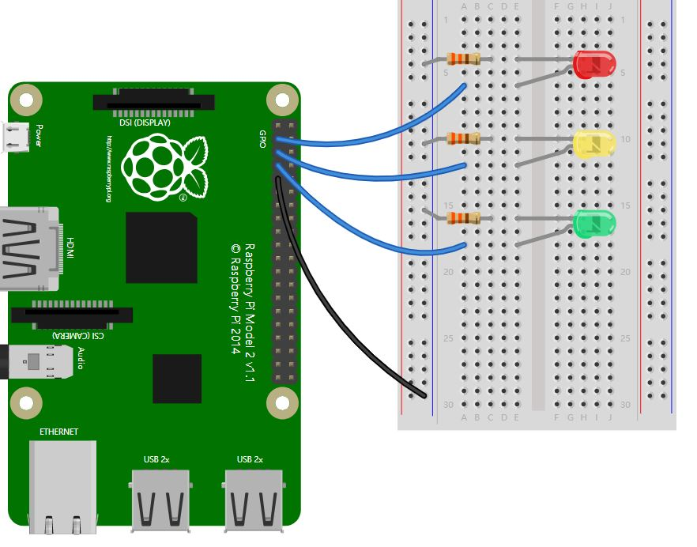
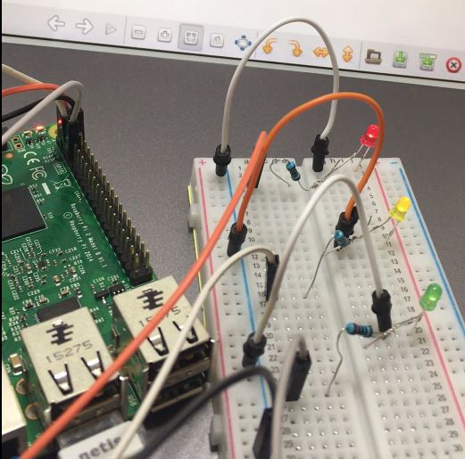
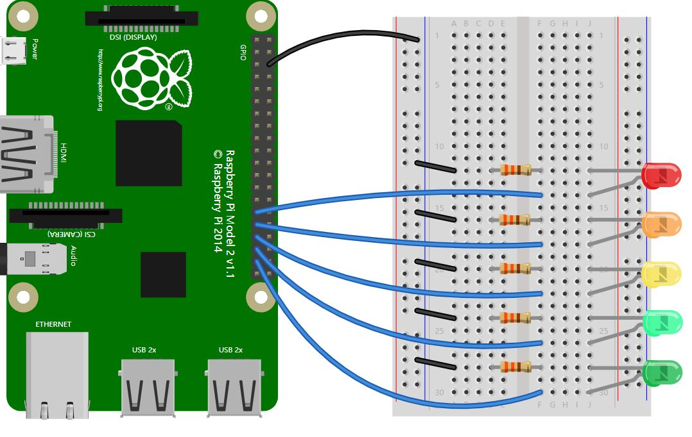
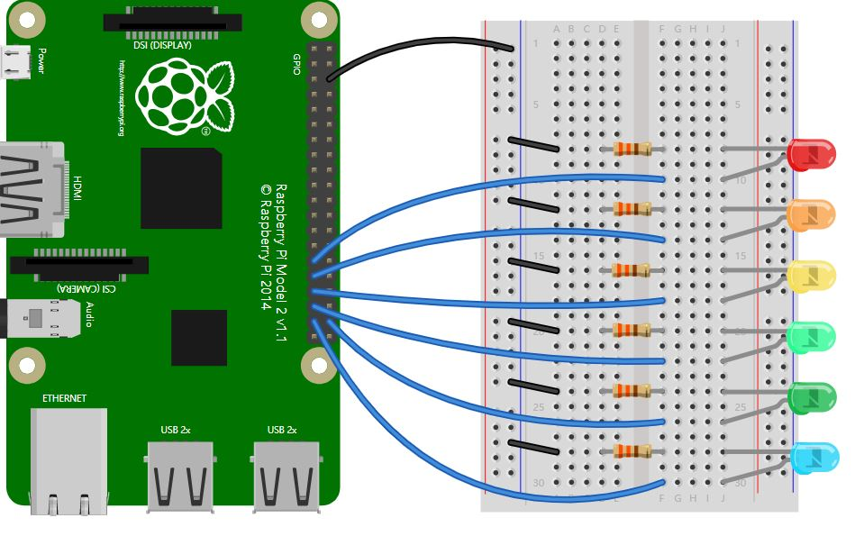
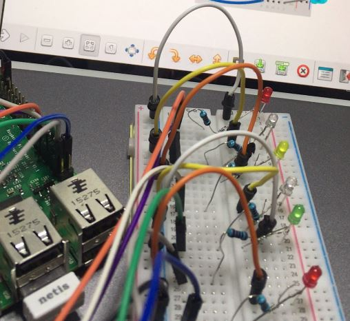

* [30个Python物联网小实验2：模拟红绿灯](#30个python物联网小实验2模拟红绿灯)
	* [交通信号灯（一）](#交通信号灯一)
	* [交通信号灯（二）](#交通信号灯二)
	* [交通信号灯（三）](#交通信号灯三)
	* [控制`LED`灯条](#控制led灯条)
	* [`LED`灯条亮度控制](#led灯条亮度控制)
	* [`LED`灯条精准控制](#led灯条精准控制)
	* [控制`LED`灯板](#控制led灯板)
	* [`LED`灯板亮度控制](#led灯板亮度控制)


## 30个Python物联网小实验2：模拟红绿灯

>以下所有实验均要求树莓派刷入完整版`Raspbian`操作系统，也就是官网上`Raspbian Stretch with desktop and recommended software`的版本。

### 交通信号灯（一）

- 接线图如下：



- 新建`TrafficLight.py`文件，代码如下：

```py
from gpiozero import TrafficLights
from time import sleep

lights = TrafficLights(2, 3, 4)

lights.green.on()

while True:
    sleep(3)
    lights.green.off()
    lights.amber.on()
    sleep(1)
    lights.amber.off()
    lights.red.on()
    sleep(3)
    lights.amber.on()
    sleep(1)
    lights.green.on()
    lights.amber.off()
    lights.red.off()

```

- 运行`python3 TrafficLight.py`，即可看到具有交通信号灯逻辑的红黄绿亮灯顺序。



### 交通信号灯（二）

对于`TrafficLight.py`文件，还有一种写法如下：

```py
from gpiozero import TrafficLights
from time import sleep
from signal import pause

lights = TrafficLights(2, 3, 4)

def traffic_light_sequence():
    while True:
        yield (0, 0, 1) # green
        sleep(3)
        yield (0, 1, 0) # amber
        sleep(1)
        yield (1, 0, 0) # red
        sleep(3)
        yield (1, 1, 0) # red+amber
        sleep(1)

lights.source = traffic_light_sequence()

pause()
```

### 交通信号灯（三）

最后，说白了虽然上面使用的是`TrafficLight`对象，当然使用`LED`对象也是一样可以完成这个任务的。

```py
from gpiozero import LED
from time import sleep

red = LED(2)
amber = LED(3)
green = LED(4)

green.on()
amber.off()
red.off()

while True:
    sleep(3)
    green.off()
    amber.on()
    sleep(1)
    amber.off()
    red.on()
    sleep(3)
    amber.on()
    sleep(1)
    green.on()
    amber.off()
    red.off()
```

### 控制`LED`灯条

- 接线图如下：



- 新建`LEDboard.py`文件，代码如下：

```py
from gpiozero import LEDBoard
from time import sleep
from signal import pause

leds = LEDBoard(5, 6, 13, 19, 26)

leds.on()
sleep(1)
leds.off()
sleep(1)
leds.value = (1, 0, 1, 0, 1)
sleep(1)
leds.blink()

pause()
```

- 在命令行界面运行`python3 LEDboard.py`，即可看到全亮、全灭、半亮、闪烁等行为。


### `LED`灯条亮度控制

- 新建`LEDboardPWN.py `文件，代码如下：

```py
from gpiozero import LEDBoard
from signal import pause
from time import sleep

leds = LEDBoard(5, 6, 13, 19, 26, pwm=True)

leds.value = (0.2, 0.4, 0.6, 0.8, 1.0)
sleep(2)
leds.pulse()

pause()
```

- `pwm=True`模式开启了`LEDBoard`对象的脉冲控制功能，这样可以控制电压的输出，在命令行界面运行`python3 LEDBoard`之后，可以观察到亮度已经有了变化，分别只有原来的`0.2,0.4,0.6,0.8,1.0`的倍数。

### `LED`灯条精准控制

- `LEDBoard`对象初始化的针脚为一个数组，可以使用`Python`支持的所有数组操作。

```py
from gpiozero import LEDBoard
from time import sleep

leds = LEDBoard(5, 6, 13, 19, 26)

for led in leds:
    led.on()
    sleep(1)
    led.off()
```
### 控制`LED`灯板

- 接线图如下：



- 新建`LEDBarGraph.py`文件，代码如下：

```py
from __future__ import division  # required for python 2
from gpiozero import LEDBarGraph
from time import sleep

graph = LEDBarGraph(5, 6, 13, 19, 26, 20)

while True:
	graph.value = 1  # (1, 1, 1, 1, 1, 1)
	sleep(1)
	graph.value = 1/2  # (1, 1, 1, 0, 0, 0)
	sleep(1)
	graph.value = -1/2  # (0, 0, 0, 1, 1, 1)
	sleep(1)
	graph.value = 1/4  # (1, 0, 0, 0, 0, 0)
	sleep(1)
	graph.value = -1  # (1, 1, 1, 1, 1, 1)
	sleep(1)
```

- 在命令行界面运行`python LEDBarGraph.py`命令，可以观察到LED灯板按照以上代码中的结构顺序进行点亮和熄灭。



### `LED`灯板亮度控制

- 当然`LEDBarGraph`同样可以开启脉冲模式：

```py
from __future__ import division  # required for python 2
from gpiozero import LEDBarGraph
from time import sleep

graph = LEDBarGraph(5, 6, 13, 19, 26, pwm=True)

while True:
	graph.value = 1/10  # (0.5, 0, 0, 0, 0)
	sleep(1)
	graph.value = 3/10  # (1, 0.5, 0, 0, 0)
	sleep(1)
	graph.value = -3/10  # (0, 0, 0, 0.5, 1)
	sleep(1)
	graph.value = 9/10  # (1, 1, 1, 1, 0.5)
	sleep(1)
	graph.value = 95/100  # (1, 1, 1, 1, 0.75)
	sleep(1)

```

好了，本次介绍就到这里，这个系列的全文会收录在我的github目录，欢迎大家star和沟通：[https://github.com/asukafighting/RaspberrypiHandbyHand](https://github.com/asukafighting/RaspberrypiHandbyHand)