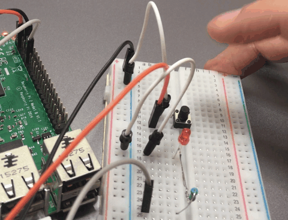
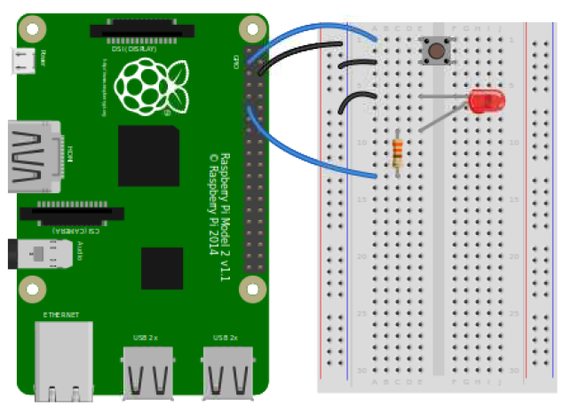
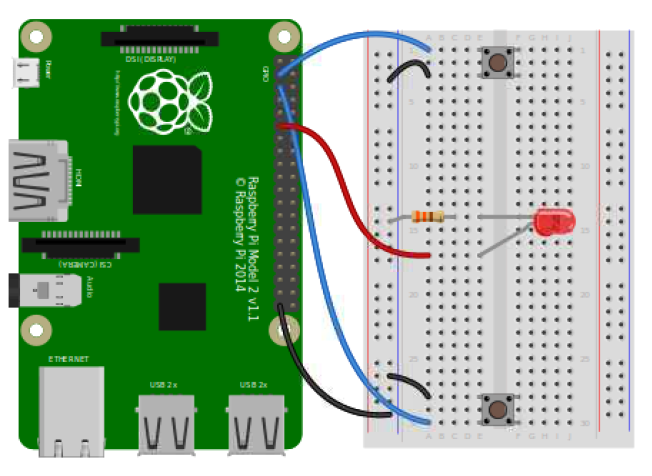

* [30个Python物联网传感器小实验3：使用按钮开灯关灯](#30个python物联网传感器小实验3使用按钮开灯关灯)
	* [使用按钮开灯关灯](#使用按钮开灯关灯)
	* [使用按钮开灯关灯（二）](#使用按钮开灯关灯二)
	* [按钮按下和松开](#按钮按下和松开)
	* [等待按钮按下才执行](#等待按钮按下才执行)
	* [按下执行特定函数](#按下执行特定函数)
	* [松开执行特定函数](#松开执行特定函数)
	* [长按4秒关机](#长按4秒关机)
	* [小游戏：谁的反应快？](#小游戏谁的反应快)

## 30个Python物联网小实验3：使用按钮开灯关灯



### 使用按钮开灯关灯

- 接线图非常简单，LED接`GPIO17`号口，按钮接`GPIO2`号口，负极接GND地线。



- 代码也非常简单：

```py
from gpiozero import LED, Button
from signal import pause

led = LED(17)
button = Button(2)

button.when_pressed = led.on
button.when_released = led.off

pause()
```

- 执行代码，按下按钮，发光二极管就会亮，松开就会灭。

### 使用按钮开灯关灯（二）

- 还有一种`source`的写法，直接把按钮的状态提供给发光二极管，达到同样的效果。

```py
from gpiozero import LED, Button
from signal import pause

led = LED(17)
button = Button(2)

led.source = button

pause()
```

### 按钮按下和松开

- 先上效果


- 接线非常简单，按钮一端连接`GPIO2`号针脚，一端连接GND地线。

- 代码灰常简单：

```py
from gpiozero import Button

button = Button(2)

while True:
    if button.is_pressed:
        print("Button is pressed")
    else:
        print("Button is not pressed")
```

### 等待按钮按下才执行

- 直接上代码吧：

```py
from gpiozero import Button

button = Button(2)

button.wait_for_press()
print("Button was pressed")
```

- 程序执行到`button.wait_for_press()`这一句之后，会先停下，等待按钮按下之后，才会继续执行。


### 按下执行特定函数

- 直接上代码：

```py
from gpiozero import Button
from signal import pause

def say_hello():
    print("Hello!")

button = Button(2)

button.when_pressed = say_hello

pause()
```

- 按下按钮，执行`say_hello()`这个函数。

### 松开执行特定函数

- 上效果图：


- 上代码：

```py
from gpiozero import Button
from signal import pause

def say_hello():
    print("Hello!")

def say_goodbye():
    print("Goodbye!")

button = Button(2)

button.when_pressed = say_hello
button.when_released = say_goodbye

pause()
```

- 按下会执行`say_hello()`函数，松开会执行`say_goodbye()`函数。

### 长按4秒关机

- 上代码：

```py
from gpiozero import Button
from subprocess import check_call
from signal import pause

def shutdown():
    check_call(['sudo', 'poweroff'])

shutdown_btn = Button(2, hold_time=4)
shutdown_btn.when_held = shutdown

pause()
```

- 增加了一个`hold_time=4`长按4秒才触发的初始化，触发之后执行`shutdown()`函数关机。

### 小游戏：谁的反应快？

- 接线图：两个按钮分别连接`GPIO2、3`号口，LED连接`GPIO 17`号口。



- 上代码：

```py
from gpiozero import Button, LED
from time import sleep
import random

led = LED(17)

player_1 = Button(2)
player_2 = Button(3)

time = random.uniform(2, 5)
sleep(time)
led.on()

while True:
    if player_1.is_pressed:
        print("Player 1 wins!")
        break
    if player_2.is_pressed:
        print("Player 2 wins!")
        break

led.off()
```

- 程序开始执行后，在(2,5)秒随机点亮LED灯，谁抢险按下按钮，就会显示谁赢了。

好了，本次介绍就到这里，这个系列的全文会收录在我的github目录，欢迎大家star和沟通：[https://github.com/asukafighting/RaspberryPiHacker](https://github.com/asukafighting/RaspberryPiHacker)