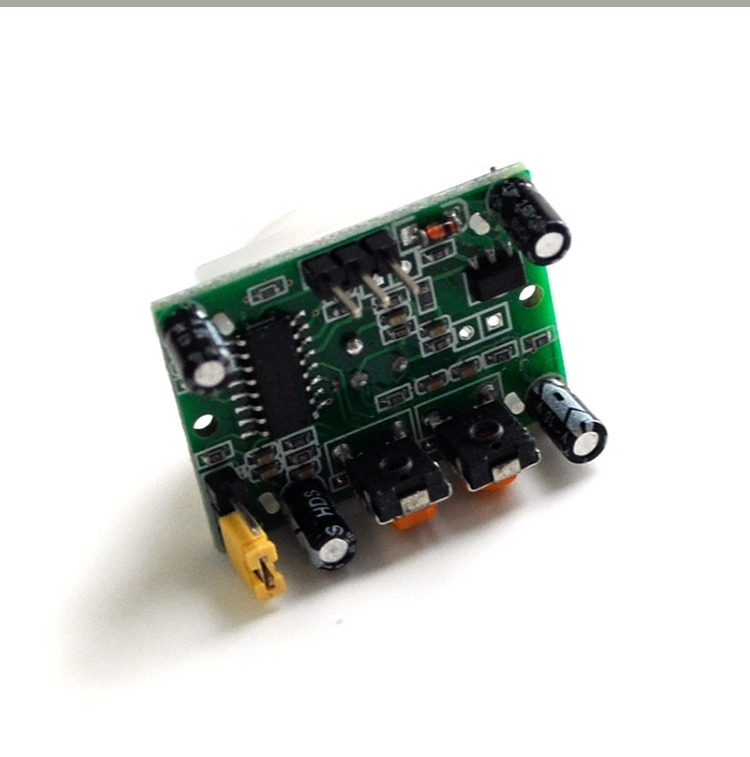
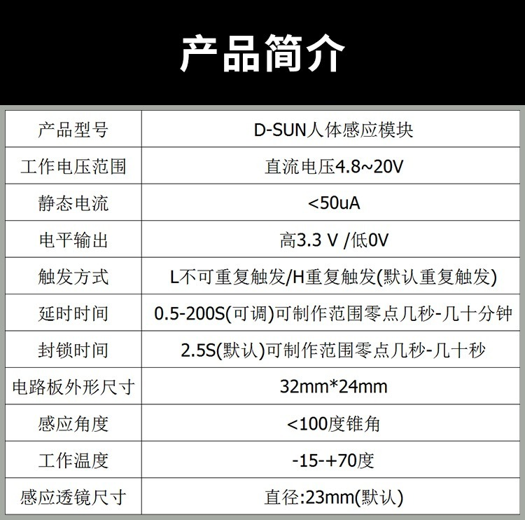
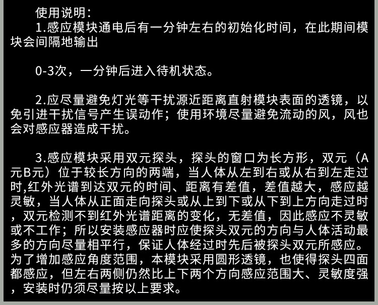
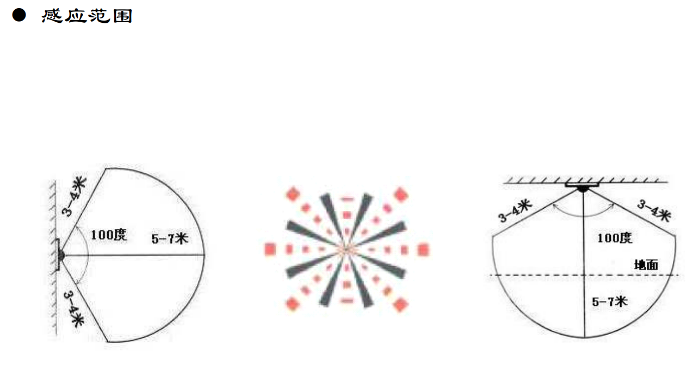

* [30个物联网传感器小实验6：人体感应器](#30个物联网传感器小实验6人体感应器)
	* [HC-SR501 简介](#hc-sr501-简介)
	* [使用方法](#使用方法)
	* [感应有人和没人](#感应有人和没人)
	* [更多API](#更多api)

## 30个物联网传感器小实验6：人体感应器


### HC-SR501 简介






### 使用方法






接线方法


### 感应有人和没人

- 接线就比较简单了，正极接树莓派的5v正极，负极接GND地线，OUT接`GPIO4`号口。

- 上代码：

```py
from gpiozero import MotionSensor

pir = MotionSensor(4)

while True :
	if pir.value:
		print("有人！")
	else:
		print("没人！")

```

- 运行代码之后，效果如文章开头的效果所示。可以使用螺丝刀不断调节灵敏度和延时，玩腻了之后，可以更改可重复触发和不可重复触发，观察不同的效果。熟悉了之后，配合光线传感器，做出一枚黑夜的人体感应灯是非常简单的。

### 更多实用API

- `value`

传感器在激活状态下，返回1。在沉默状态下，返回0。

- `wait_for_motion(timeout=None)`

阻塞进程，检测到人体运动才返回，继续执行。

- `wait_for_no_motion(timeout=None)`

阻塞进程，检测到人体运动停止才返回，继续执行。

- `when_motion`

不阻塞进程，检测到人体运动则自动执行函数。

- `when_no_motion`

不阻塞进程，检测到人体运动停止则自动执行函数。

好了，本次介绍就到这里，这个系列的全文会收录在我的github目录，欢迎大家star和沟通：[https://github.com/asukafighting/RaspberryPiHacker](https://github.com/asukafighting/RaspberryPiHacker)